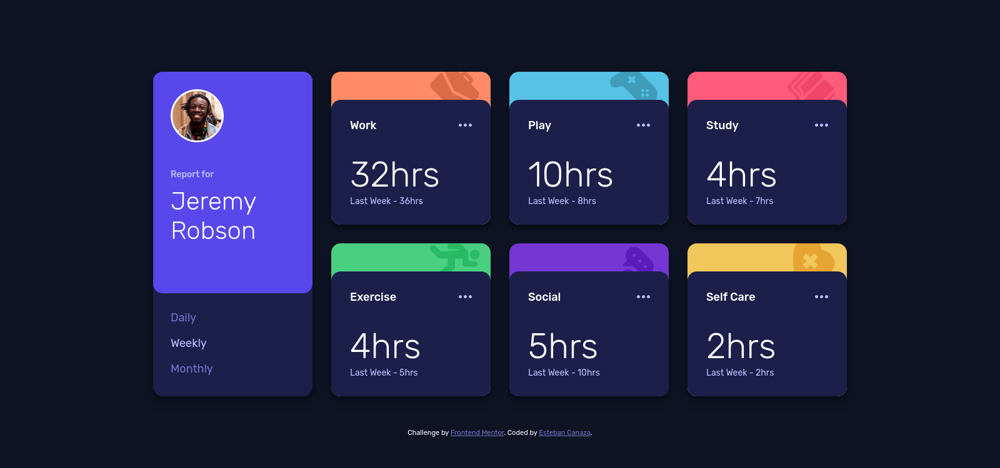

# Frontend Mentor - Time tracking dashboard solution

This is a solution to the [Time tracking dashboard challenge on Frontend Mentor](https://www.frontendmentor.io/challenges/time-tracking-dashboard-UIQ7167Jw). Frontend Mentor challenges help you improve your coding skills by building realistic projects.

## Built with

- HTML
- SASS
- Typescript
- eslint
- BEN methodology
- GIT

## Solution

[Time tracking dashboard challenge challenge ](https://stebanc.github.io/time-tracking-dashboard/).

